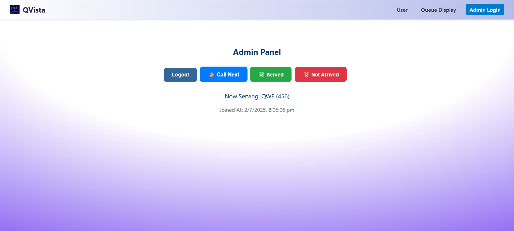

# QVista

**QVista** is a smart and user-friendly digital queue management system designed to streamline check-ins and reduce wait times. Users can effortlessly join the queue, while admins manage flow through real-time controls and status updates. With its clean interface and seamless experience.


## Features

- **Join Queue**: Users can join a live queue virtually with a single click.
- **Queue Display**: Displays the current queue status in real time for users, ensuring they stay informed of their position.
- **Admin Panel**: Admin can view the current queue and take actions such as:
  - **Call Next**: Progress the queue by calling the next user.
  - **Mark as Served**: Indicate that a user has been served.
  - **Mark as Not Arrived**: Move absent users to a separate list for no-shows.
- **No-Show Management**: Users marked as "Not Arrived" are moved to a separate list where they can:
  - Choose to **rejoin the queue**, or
  - **Exit** the process entirely.

## Tech Stack

- **Frontend**: React.js
- **Backend**: Node.js, Express
- **Database**: MongoDB
- **Hosting**: Vercel (Frontend), Render (Backend)

## Live Demo

🔗 [https://qvista.vercel.app](https://qvista.vercel.app)

## Preview





## Setup Instructions

1. Clone the repository:
   ```bash
   git clone https://github.com/BavithSuvarna/QVista.git
   ```
2. Navigate into the project directory:
   ```bash
   cd QVista
   ```
3. Install frontend dependencies
   ```bash
   cd client
   npm install
   ```
4. Install backend dependencies
   ```bash
   cd ../server
   npm install
   ```
5. Set up Environment Variables
   Create .env files in both client and server folders (if required) with necessary keys like API endpoints, DB connection strings, etc.
6. Start the application:
     Start the backend server:
     ```bash
     cd server
     npm start
     ```
     Start the frontend app:
     ```bash
     cd ../client
     npm start
     ```
7. Visit the application at http://localhost:3000 in your browser.
